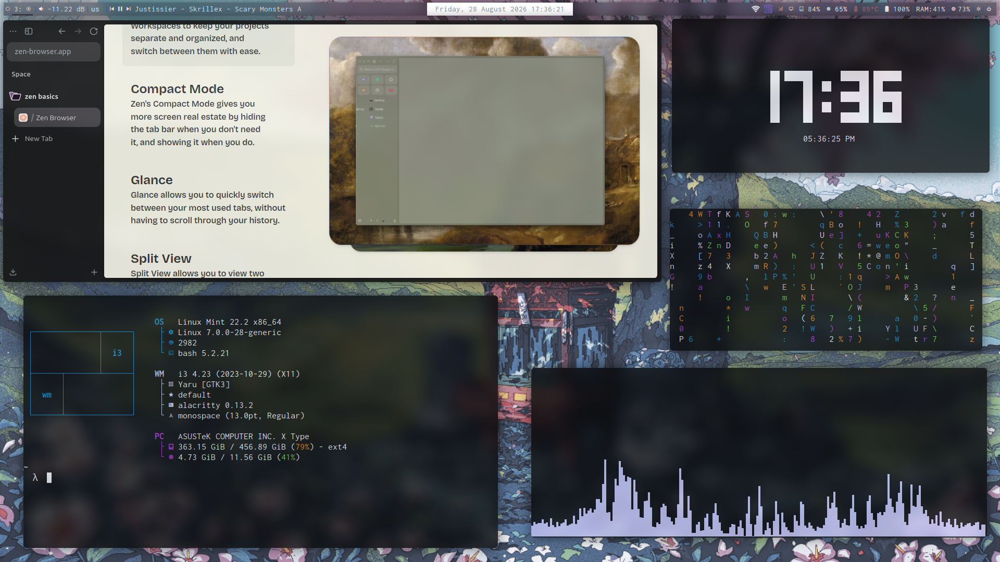

# Light-i3-dotfiles

A lightweight and minimalistic desktop environment built around the **i3 window manager**.
This i3wm setup was made on Linux Mint 22.2 Zara XFCE. **Note:** This setup is still work in progress, It is meant to be as lightweight as possible while still looking aesthetically pleasing.



## Features

-  i3 window manager
-  Polybar
-  Rofi application launcher
-  Picom compositor
-  i3lock (optional)
-  Alacritty terminal
-  Dunst notifications
-  Redshift night mode
-  Game mode
-  Wallpaper collection
-  Fastfetch configuration
-  Volume and media controls
-  Brightness controls
-  Screenshot utilities
-  Lightweight and keyboard-driven workflow

## Installation

Clone the repository:

```bash
git clone https://github.com/Miraakz9/Light-i3-dotfiles.git
cd Light-i3-dotfiles
```
## Auto install everything for fresh i3wm installation

Auto installer for fresh i3wm installation is untested,  13 needs to be installed manually.

```bash
chmod +x install.sh
./install.sh
```
The installer will install the required dependencies and deploy the configuration files.

Note: This install script is designed for Linux Mint / Ubuntu-based systems. Mod+D to view keybinds.

**Use [Gogh](https://gogh-co.github.io/Gogh/) for terminal themes.**
